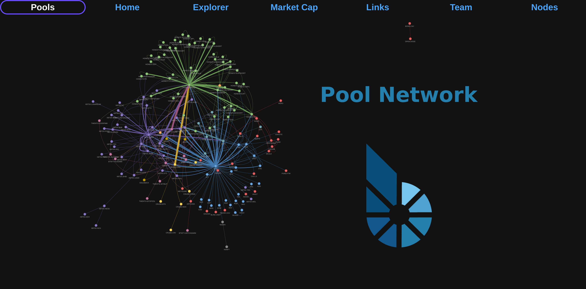
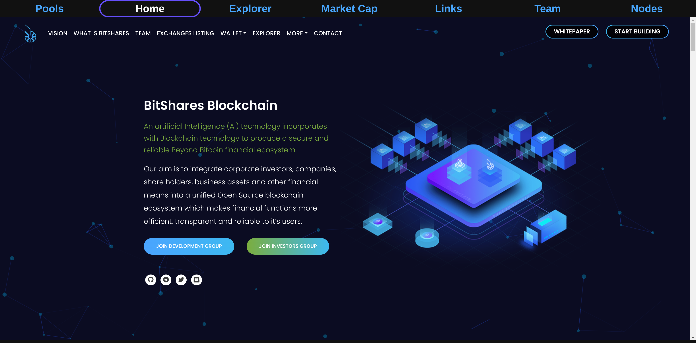
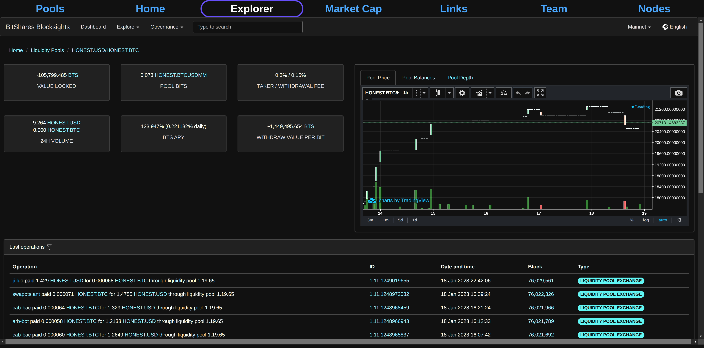
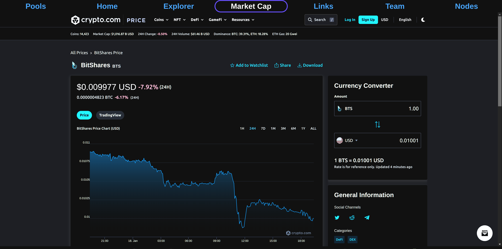
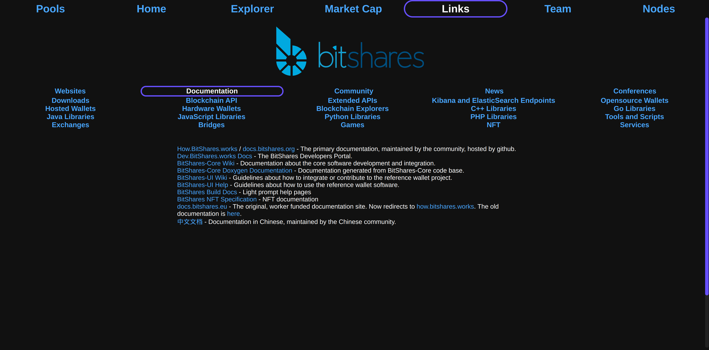
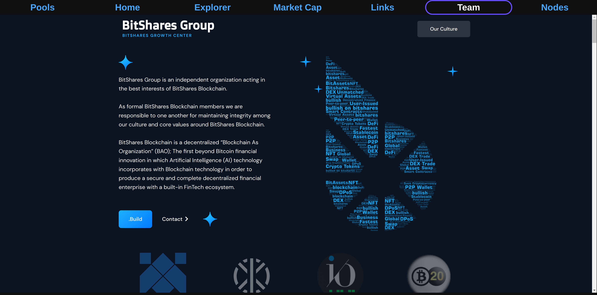
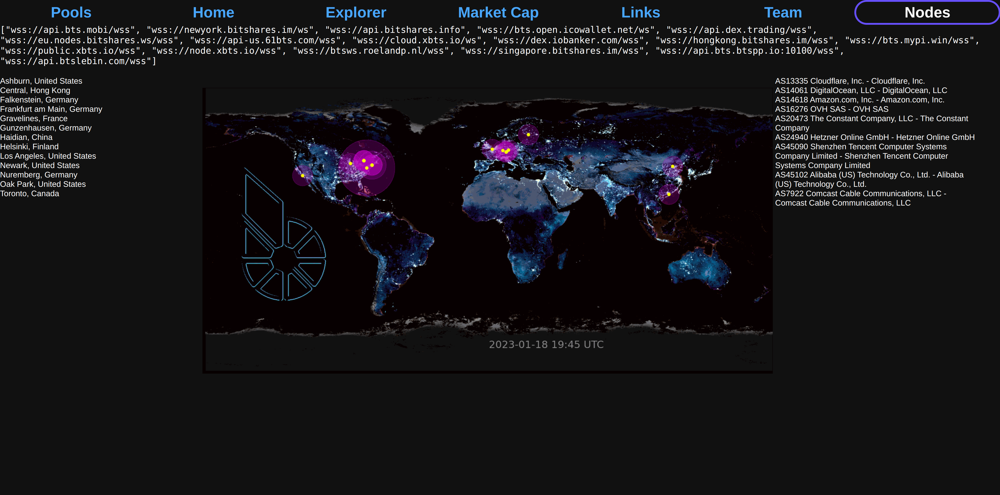

# Bitshares.Network

Install:

`bash install.sh`

Deploy:

`python3 main.py`

^^ Continually updates `bitshares_network.html` and its subfiles.

`splash.html` is the splash screen for the website, and redirects to `bitshares_network` on the press of a button.  `splash.html` is the index page.